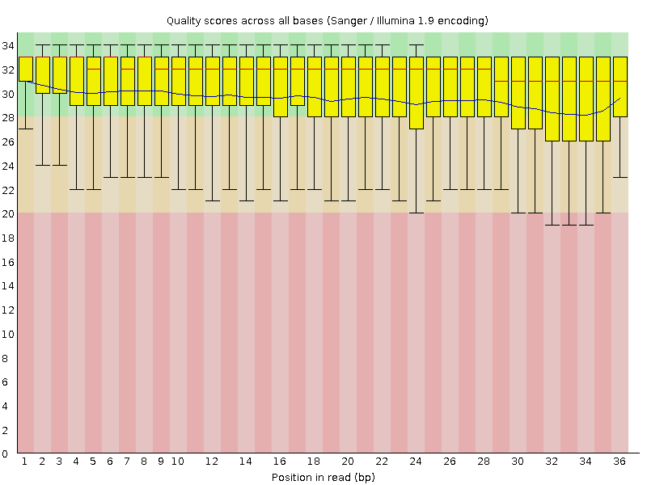

# hse_hw2_chip

Скачивем необходимые файлы для работы с выбранными клеточной линией и гистоновой меткой.

```
# ChIP-seq на гистоновой метке
# ENCFF889AII
!wget https://www.encodeproject.org/files/ENCFF889AII/@@download/ENCFF889AII.fastq.gz
# ENCFF500BZD
!wget https://www.encodeproject.org/files/ENCFF500BZD/@@download/ENCFF500BZD.fastq.gz

# ChIP-seq контроль
# ENCFF282SBH for ENCSR503UNI
!wget https://www.encodeproject.org/files/ENCFF282SBH/@@download/ENCFF282SBH.fastq.gz
```

Затем смотрим качество чтений. Оно в целом не очень хорошее.


Применяем подрезание чтений.




Качество чтений улучшается.

Вывод bowtie после выравнивания на хромосому:

- Для первой реплики:
```
12215124 reads; of these:
  12215124 (100.00%) were unpaired; of these:
    9389264 (76.87%) aligned 0 times
    503612 (4.12%) aligned exactly 1 time
    2322248 (19.01%) aligned >1 times
23.13% overall alignment rate 
```

- Для второй реплики:
```
8182996 reads; of these:
  8182996 (100.00%) were unpaired; of these:
    6529168 (79.79%) aligned 0 times
    305070 (3.73%) aligned exactly 1 time
    1348758 (16.48%) aligned >1 times
20.21% overall alignment rate
```

- Для контроля:
```
13434474 reads; of these:
  13434474 (100.00%) were unpaired; of these:
    11271018 (83.90%) aligned 0 times
    561592 (4.18%) aligned exactly 1 time
    1601864 (11.92%) aligned >1 times
16.10% overall alignment rate
```
***Ответы на вопросы:***

Процент совпадений довольно маленький из-за того что выравнивание делается только на одну хромосому.
Да, имеет смысл для дальнейшего анализа отобрать уникально картированные риды.
